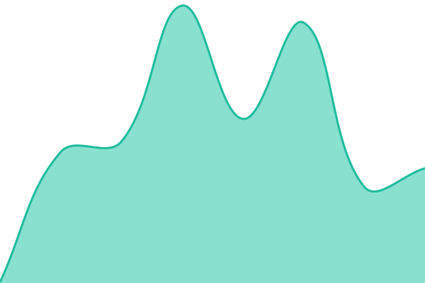

# [📈 Live Status](https://status.swiftfiddle.com): <!--live status--> **🟧 Partial outage**

This repository contains the open-source uptime monitor and status page for [SwiftFiddle Project](https://swiftfiddle.com/), powered by [Upptime](https://github.com/upptime/upptime).

With [Upptime](https://upptime.js.org), you can get your own unlimited and free uptime monitor and status page, powered entirely by a GitHub repository. We use [Issues](https://github.com/SwiftFiddle/status.swiftfiddle.com/issues) as incident reports, [Actions](https://github.com/SwiftFiddle/status.swiftfiddle.com/actions) as uptime monitors, and [Pages](https://status.swiftfiddle.com) for the status page.

<!--start: status pages-->
<!-- This summary is generated by Upptime (https://github.com/upptime/upptime) -->
<!-- Do not edit this manually, your changes will be overwritten -->
<!-- prettier-ignore -->
| URL | Status | History | Response Time | Uptime |
| --- | ------ | ------- | ------------- | ------ |
|  [swiftfiddle.com](https://swiftfiddle.com/) | 🟩 Up | [swiftfiddle-com.yml](https://github.com/SwiftFiddle/status.swiftfiddle.com/commits/HEAD/history/swiftfiddle-com.yml) | 

 266ms
     
 | 

<a href="https://status.swiftfiddle.com/history/swiftfiddle-com">100.00%</a>
    

|  [runner.swift-playground.com](https://runner.swift-playground.com/) | 🟩 Up | [runner-swift-playground-com.yml](https://github.com/SwiftFiddle/status.swiftfiddle.com/commits/HEAD/history/runner-swift-playground-com.yml) | 

 450ms
     
 | 

<a href="https://status.swiftfiddle.com/history/runner-swift-playground-com">100.00%</a>
    

|  [lsp.swift-playground.com](https://lsp.swift-playground.com/) | 🟥 Down | [lsp-swift-playground-com.yml](https://github.com/SwiftFiddle/status.swiftfiddle.com/commits/HEAD/history/lsp-swift-playground-com.yml) | 

 414ms
     
 | 

<a href="https://status.swiftfiddle.com/history/lsp-swift-playground-com">100.00%</a>
    

<!--end: status pages-->

[**Visit our status website →**](https://status.swiftfiddle.com)

## 📄 License

- Powered by: [Upptime](https://github.com/upptime/upptime)
- Code: [MIT](./LICENSE) © [SwiftFiddle Project](https://swiftfiddle.com/)
- Data in the `./history` directory: [Open Database License](https://opendatacommons.org/licenses/odbl/1-0/)
